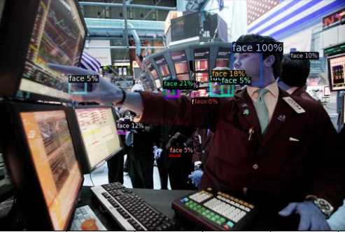
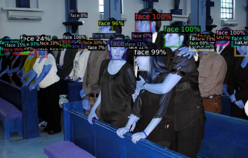

# CSI5341 Project
Transfer Learning in Object Detection: A Comparative Study Using the UniDet model on Wider Face Dataset

## Main results
|                  |mAP       |AP50  |AP75  |APs     |APm     |API     |
|------------------|----------|------|------|--------|--------|--------|
|Single Detector   |26.871    |52.195|25.597|15.837  |51.825  |61.186  |
|Unified Detector  |30.080    |57.789|28.883|18.610  |55.692  |65.622  |

## Installation
Our project is based on [detectron2](https://github.com/facebookresearch/detectron2). Please follow the official [detectron2 installation](https://github.com/facebookresearch/detectron2/blob/master/INSTALL.md).

## Reproduce
- Download WIDER FACE Dataset, and place in correct place
~~~
$ROOT/
    single/
        dataset/
~~~

- Download pre-trained unified detector model from [Google Drive](https://drive.google.com/drive/folders/1_MOKmhswLbdRh2-jIHNrXM5pm2cjQzTs)
~~~
$ROOT/
    transfer/
        model/
~~~

## Example result
Single dataset detector:

  

Unified Detector (transfer learning approach)

  

